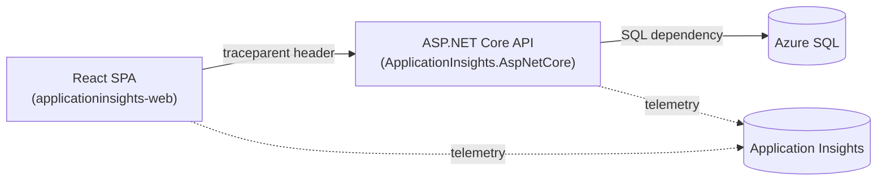

# 02 - Observability

Production-grade Application Insights observability for Gino's Gelato. This
document describes what is instrumented, how telemetry correlates end to end,
and the KQL queries used to verify and monitor the system.

> Authoritative context: [00 - Project Vision](00-Project-Vision.md)

## Telemetry Architecture



A single browser checkout, the resulting API request, its Azure SQL
dependencies, and the server-side `OrderCreated` business event all share one
`operation_Id`, so the full journey can be reconstructed from any one signal.

## What Is Instrumented

### Browser (React)
- Automatic page views and SPA route changes.
- AJAX/fetch dependency tracking for every API call.
- Unhandled exception tracking.
- CORS correlation (`enableCorsCorrelation`) so browser calls link to API requests.
- Custom business events: `CheckoutStarted`, `CheckoutStepCompleted`,
  `OrderCompleted`, and the `OrderRevenue` metric.

### API (ASP.NET Core)
- `AddApplicationInsightsTelemetry()` provides request telemetry, distributed
  tracing (W3C Trace Context), and `ILogger` integration.
- Automatic Azure SQL dependency tracking, with SQL command text captured via
  `EnableSqlCommandTextInstrumentation`.
- Custom business event `OrderCreated` (properties: `confirmationNumber`,
  `fulfillmentType`, `status`; metrics: `orderTotal`, `itemCount`).
- The `Request-Context` response header is exposed through CORS so the browser
  SDK can complete cross-origin correlation.

### Configuration
- API reads `APPLICATIONINSIGHTS_CONNECTION_STRING` (App Service app setting,
  wired in [configSettings.bicep](../../../iac/configSettings.bicep)).
- The client build consumes `VITE_APPINSIGHTS_CONNECTION_STRING`, sourced from
  the `appInsightsConnectionString` output of [main.bicep](../../../iac/main.bicep).
- No connection strings or secrets are committed to source control.

## KQL Queries

Run these in the Application Insights **Logs** blade.

### 1. End-to-end correlation for a single checkout
Given a confirmation number, find every correlated signal.

```kql
customEvents
| where name == "OrderCreated"
| extend confirmationNumber = tostring(customDimensions.confirmationNumber)
| where confirmationNumber == "GG260727-00001"
| project operation_Id, timestamp, confirmationNumber
| join kind=leftouter (
    union requests, dependencies, traces, customEvents
    | project operation_Id, itemType, name, timestamp, duration
  ) on operation_Id
| order by timestamp asc
```

### 2. Verify every checkout produces correlated browser + API + SQL telemetry
Counts the distinct telemetry types per checkout operation.

```kql
customEvents
| where name == "OrderCreated"
| project operation_Id
| join kind=inner (
    union requests, dependencies
    | summarize
        apiRequests = countif(itemType == "request"),
        sqlDependencies = countif(itemType == "dependency" and type == "SQL")
      by operation_Id
  ) on operation_Id
| project operation_Id, apiRequests, sqlDependencies
```

### 3. Azure SQL dependency performance
```kql
dependencies
| where type == "SQL"
| summarize count(), avg(duration), percentile(duration, 95) by target, name
| order by avg_duration desc
```

### 4. Order volume and revenue (business events)
```kql
customEvents
| where name == "OrderCreated"
| extend total = todouble(customMeasurements.orderTotal)
| summarize orders = count(), revenue = sum(total) by bin(timestamp, 1h)
| order by timestamp asc
```

### 5. Checkout funnel (browser events)
```kql
customEvents
| where name in ("CheckoutStarted", "CheckoutStepCompleted", "OrderCompleted")
| summarize count() by name
```

### 6. Failed requests and exceptions
```kql
requests
| where success == false
| join kind=leftouter (exceptions | project operation_Id, problemId, outerMessage) on operation_Id
| project timestamp, name, resultCode, problemId, outerMessage
| order by timestamp desc
```

## Validation Checklist
- Every checkout emits `CheckoutStarted` (browser) → API `POST /api/orders`
  request → Azure SQL dependencies → `OrderCreated` (API) → `OrderCompleted`
  (browser), all sharing one `operation_Id` (Query 1 and 2).
- SQL dependencies appear with command text (Query 3).
- Browser, API, and SQL traces correlate (Query 1).
- The KQL queries above return data once traffic flows.

Application behavior is unchanged; telemetry is additive.
